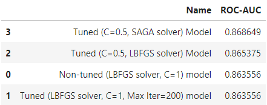
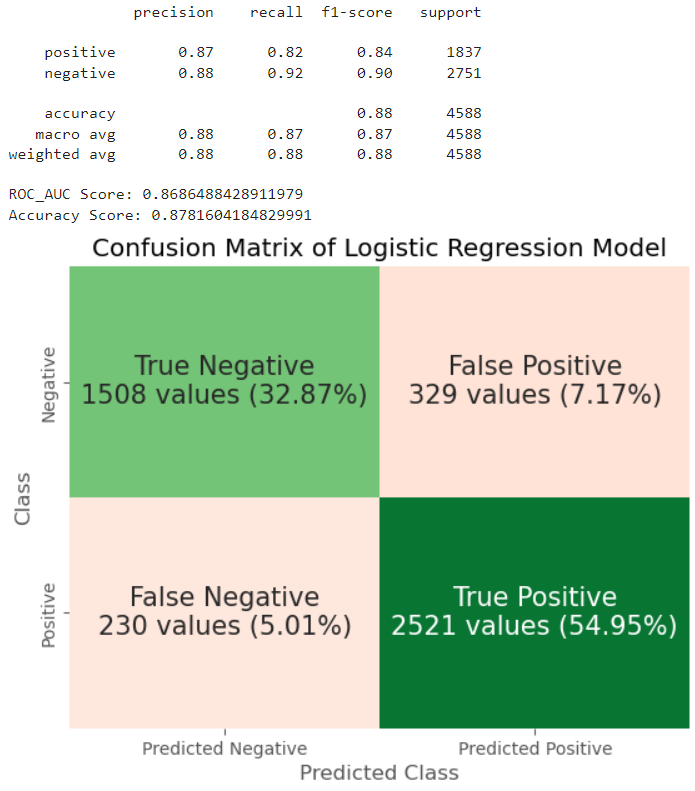
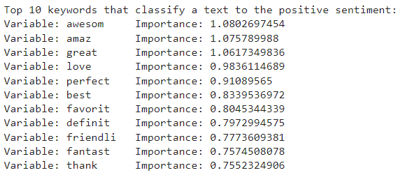
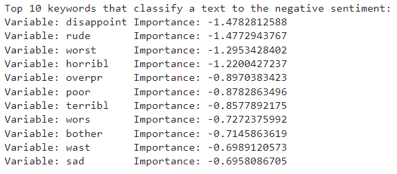
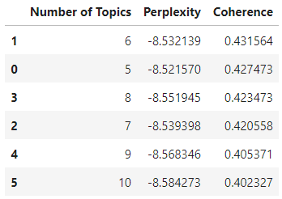
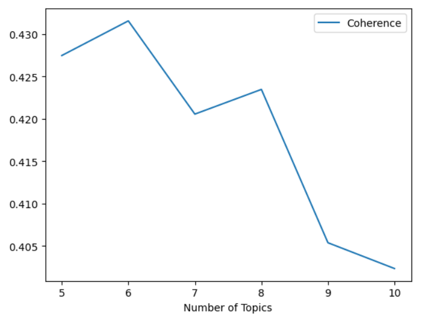
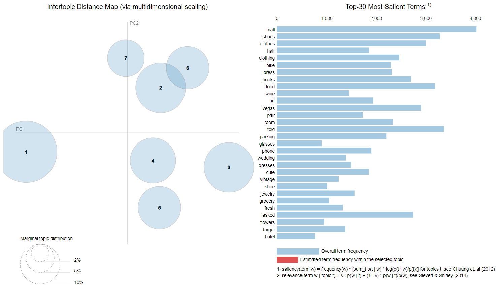
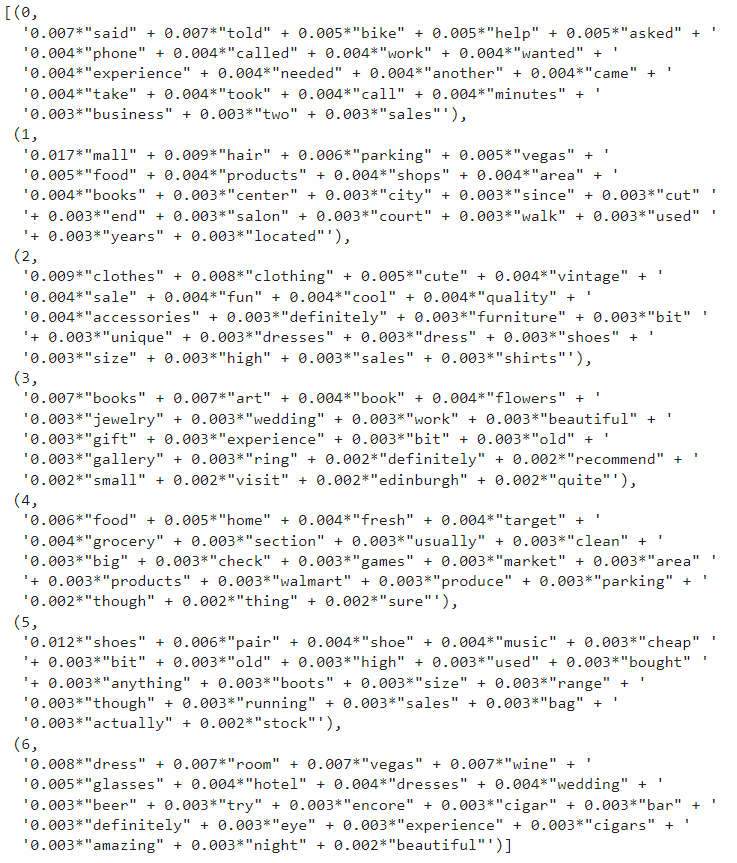

# Background

<b>Sentiment Analysis</b> generate insights into how companies can enhance customer experience and improve customer service. Businesses can use machine-learning-based sentiment classification to examine text for <u>positive or negative sentiment</u> about the brand. 

Benefit of Sentiment Analysis: Companies have an opportunity to respond meaningfully. This aim to improve customer relationship, enhance customer loyalty and retention through better service outcomes and customer experience. 

<b>Topic Modelling</b> discover abstract ‘topics’ that exist within a collection of documents. It scans or ‘mines’ text to detect frequently used words or phrases and groups them to provide a summary that best represents the information in the document. 

Benefit of Topic Modelling: Businesses can use these ‘topics’ to understand what their customers struggle with, care about and wants to see next. 

# Goal
The goal of this assignment is to perform sentiment analysis and topic modelling of the review text of eCommerce shopping platforms. 
 
# Tasks

 -  Develop a sentiment classification model to predict the sentiment of the review text. Businesses will be able to use this model to predict the sentiment of a new review.

-  Develop a topic model to help understand the text in the review to a particular topic. This analysis aims to be accompaniment to the results of the sentiment classification and helps businesses to identify main topic that customers are concern about. 

# Preview of Work Done for Machine Learning
Please check out the PDFs for the detailed data understanding and data preparation process.

## Sentiment Analysis Machine Learning
In the modelling section, I used the following models for sentiment classification:

1. Random Forest
2. Logistic Regression
3. Extreme Gradient Boosting (XGB) Classifier

Reason for choosing the above models:

1. Random Forest Classifier is an ensemble method that creates and uses the result of multiple decision trees to make a prediction; it can handle non-linear relationships and high-dimensional data. It also has the featureimportances attribute, which reveals which features are influential in determining the sentiment of a text.

2. Logistic Regression is a linear model that models the relationship between the features and the target variable as a linear combination. Logistic Regression also has the coef_ attribute, revealing the weight of terms in the two sentiment classes. Additionally, it can handle large datasets and be tuned to be more regularized to avoid overfitting, making it a good choice for sentiment analysis.

3. As with Random Forest Classifiers, XGBoost combines multiple decision trees to make predictions. Therefore, it can handle non-linear relationships and high-dimensional data. It can also handle large datasets and has the featureimportances attrbiute which can be used to understand what features are important in determining the sentiment of a text.

Therefore, I used these 3 models due to its good performance and classification approaches.

### Evaluation Criteria: 

AUC-ROC is a metric that measures the ability of a model to distinguish between positive and negative classes. It plots the True Positive Rate (TPR) against the False Positive Rate (FPR) at various threshold values and computes the area under the resulting curve.

The AUC-ROC is a robust metric that is insensitive to class imbalance, so it can be used to evaluate the performance of the sentiment analysis model with a class distribution of 60:40 for positive:negative respectively. A high AUC-ROC value indicates that the model is able to distinguish between positive and negative instances, regardless of the class distribution.

ROC-AUC is expressed as a decimal value ranging from 0 to 1.

A value of 0.5 represents a random guess, while a value of 1 represents a perfect model that perfectly separates positive and negative classes. A value of 0 represents a model that performs worse than random guessing.

Thus, I looked for a model that produces the highest AUC-ROC score.

### Training

I tested the different models on different types of features:
- Word Feature Set
- Term Frequency Bag of Words
- TF-IDF Bag of Words

Based on the tests, the Logistic Regression model performed the best with the Term Frequency Bag of Words data, with an ROC-AUC score of 86.3%. Therefore, I decided to perform hyperparameter tuning on it to improve it, seen below. For reason on why each hyperparameter is tuned, check out the PDF.

### Results

Above is the best tuned Logistic Regression's Confusion Matrix and classification report. The Logistic Regression's classification is good with majority (87.82%) of the the texts being correct classification. Meanwhile, the false positive and negative rate is low at only 12.18%.

A value of 0.5 represents a random guess, while a value of 1 represents a perfect model that perfectly separates positive and negative classes. A value of 0 represents a model that performs worse than random guessing. The classification has a high ROC_AUC score of 86.82%, which is roughly 15% away from being a perfect model.

In addition to the model performance, I also extracted the top 10 words for the model's classification of the texts' sentiment.

These are the top 10 features that are mostly used to classify a text to the postivie/negative sentiment. The terms are mostly adverbs/adjectives such as 'awesom' or 'disappoint'. Therefore, adjectives/adverbs are necessary in sentiment analysis.

This also shows how well the Logistic Regression classifier learns from the data as all the terms used to classify the positive/negative sentiments in the model are correct terms used to determine the sentiment of a text from a human's perspective.

## Topic Modelling Machine Learning

For Topic Modelling, I used the Latent Dirichlet Allocation model by the gensim library.

### Evalulation Criteria

1. Perplexity Score

- Perplexity is calculated by taking the log likelihood of unseen text documents given the topics defined by a topic model.
- A good model will have a high likelihood and resultantly low perplexity.
- But sometimes these metrics are not correlated with human interpretability of the model, which can be impractical in a business setting.

2. Coherence Score

- Topic coherence looks at a set of words in generated topics and rates the interpretability of the topics. The higher the value, the better the model.

### Training

Due to the large number of texts within the dataset and previous trainings, I decided to focus on 5 to 10 topics.

### Coherence Score

The perplexity scores are all quite close, between -8.32 to -8.58. Therefore, I evaluated the models based on their coherence. Topic 6 has highest Coherence. Therefore, I check out its intertopic distance.

### Plotting the Intertopic Distance Map

7 Topics is the optimal number of topics as the topics are quite well spread and have only 1 overlap between topics 2 and 6 which is related to clothes. This shows that the model is able to differentiate the topics well and create clusters that do not overlap alot with each other.

### Results

- topic 0 seems to be about bikes
- topic 1 seems to be about malls
- topic 2 seems to be about clothes
- topic 3 seems to be about wedding decorations
- topic 4 seems to be about supermarkets
- topic 5 seems to be about shoes
- topic 6 seems to be about hotel weddings